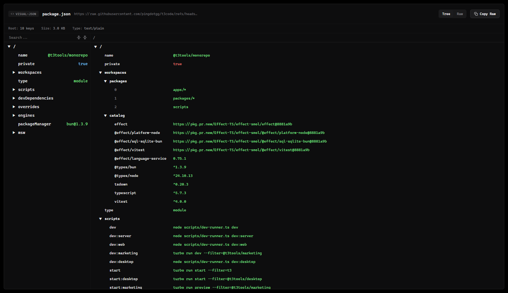

# JSON Inspector

[中文说明](./README_CN.md)

A small Manifest V3 browser extension for inspecting raw JSON documents with [`visual-json`](https://github.com/vercel-labs/visual-json).

It replaces plain JSON pages with a structured viewer, keeps the original URL visible, and provides a compact raw-text fallback when needed. The project is intended for personal or internal use rather than store distribution.



## Highlights

- Read JSON documents in a structured tree view
- Switch between tree and raw modes
- Copy the original payload directly from the page
- Works with remote `.json` URLs and local files when file access is enabled
- Built on top of `@visual-json/react` and `@visual-json/core`

## Installation

### Load as an unpacked extension

1. Install dependencies:

```bash
bun install
```

2. Build the extension:

```bash
bun run build
```

3. Open your browser extension page:

- Chrome: `chrome://extensions`
- Edge: `edge://extensions`

4. Enable developer mode.

5. Choose `Load unpacked` and select [`dist`](/root/i/visual-json-browser-extension/dist).

### Local file access

If you want the extension to work with local `file://` JSON files, enable the browser option usually labeled `Allow access to file URLs` on the extension details page.

## Development

```bash
bun install
bun run dev
```

`tsdown` writes the content script bundle to `dist/`. After rebuilding, reload the unpacked extension from the browser extension page.

## Project Structure

- [`src/content.tsx`](/root/i/visual-json-browser-extension/src/content.tsx): content script entry and viewer bootstrap
- [`src/styles.css`](/root/i/visual-json-browser-extension/src/styles.css): extension UI styling
- [`manifest.json`](/root/i/visual-json-browser-extension/manifest.json): Manifest V3 definition
- [`tsdown.config.ts`](/root/i/visual-json-browser-extension/tsdown.config.ts): bundling configuration

## Notes

- The extension only activates on pages that appear to contain JSON.
- The current workflow is based on unpacked local installation.
- No background service or remote backend is required.

## License

MIT
